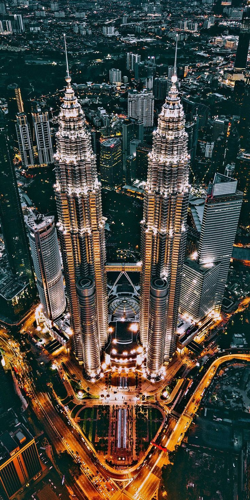
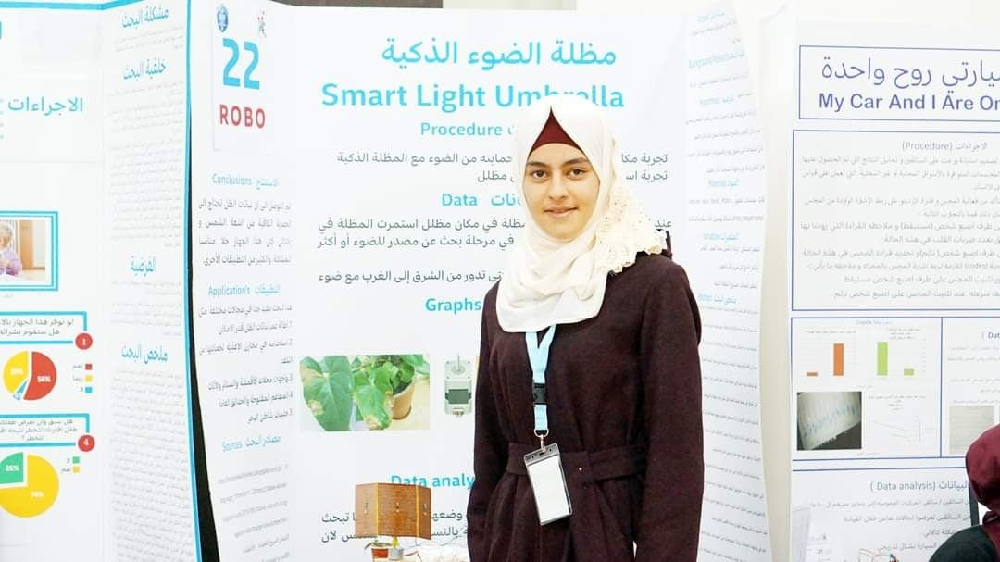
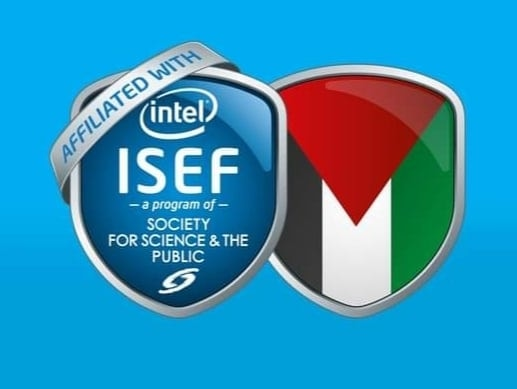
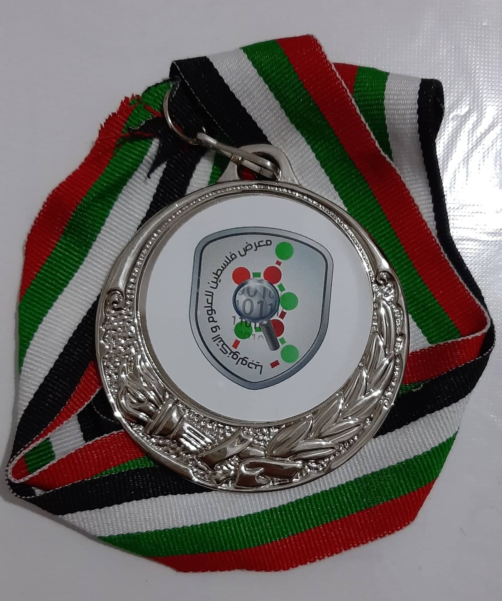

# besan-khalil.github.io
my personal website
<!DOCTYPE html>
<html lang="en">
<head>
<title>Besan Khalil</title>

</head>
<body style="text-align:center; background-color:#D0FBFA;">
<h1>Web Development-Assignment 1</h1>
<h2>Besan Hosny Ibrahim Khalil</h2>

<b>Please chick this link: </b>

<a href="https://www.pinterest.com">this is a program to download pictures</a>
<h2 style="text-align:left;">Summary about me ...</h2>

Hi there! My name is Besan, And i have 19 years old, I finished my high school studies at Kufur Thulth Girls Secondary School, Then i
 
joined An-Najah National University to study Computer Science major, I'm in my second year now, And My GPA is 2.65.

<h2 style="text-align:left;">My education background ...</h2>
<ol style="text-align:left;">
<li>finished my high school studies.</li>
<li>studying computer science at An-Najah National University.</li> 
<li>In 2018, I have participated in the Palestine Science and Technology Fair (PSTF), In the Ministry of Education and Higher Education 
 
in Qalqilya, I won sixth place in the first phase, and the second phase was in Ramallah in alhilal al'ahmar Hotel, where the duration
 
of this phase was 3 days, And i didn't win any position at this stage, but it was a wonderful experience, I benefited from several 
 
things, including improving the method of explanation, and getting acquainted with the ideas of other projects.</li>
</ol>

 
<h2 style="text-align:left;">My work experiences ...</h2>
<ul style="text-align:left;">
<li>I don't have any work experience yet...</li>
</ul>
<h2 style="text-align:left;">My hobbies ...</h2>
<dl style="text-align:left;">
<dt>*About art:</dt>
<dd>-drawing.<dd>
<dd>-singing.</dd>
<dd>-writing stories.</dd>
<dd>-clothes designing.</dd>
<dt>*About computer science:</dt>
<dd>-coding.</dd>
<dt>*About other things:</dt>
<dd>-watching anime.</dd>
<dd>-listening to music all day long.</dd>
<dd>-reading stories.</dd>
</dl>

<b>~Thank You For Reading~</b>

</body>
</html>
